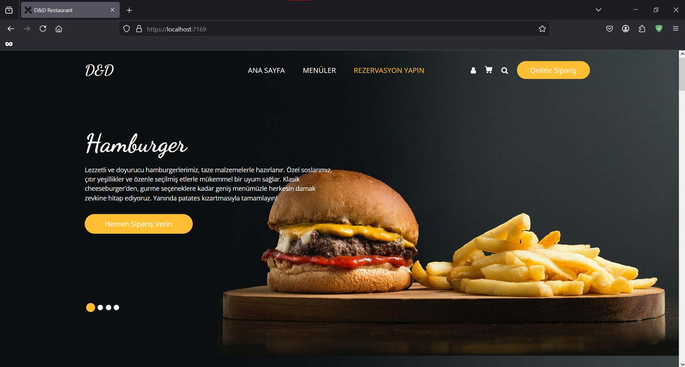

# Asp.Net Core Api SignalR ile QR Kodlu Sipariþ Yönetimi

**Proje Hakkýnda**

* Bu proje N-Tier mimarisiyle oluþturulmuþ, veriler Docker üzerinde Portainer ile ayaða kaldýrýlmýþ MSSQL kullanýlarak depolanmýþ,
Duendde IdentityServer ile JWT token'lar oluþturularak güvenliði saðlanmýþ,
anlýk veirlerin Ajax ve SignalR ile alýndýðý bir sipariþ yönetim projesidir.

* Ana sayfada menüleri görüntüleyebilir, rezervasyon yapabilir, Help Desk üzerinden mesajlarýnýzý Admin kullanýcýlarýna iletebilir, kullanýcý kaydý oluþturup kullanýcýnýzla yorum yapabilirsiniz.

* Menüde yer alan ürünleri kategorilerine göre filtreyebilir ve sepetinize ekleyebilirsiniz. Sepet sayfasýnda ana sayfada yer alan indiirmler bölümündeki indiirm kodunu uygulayarak anlýk indirimlerden yararlanabilirsiniz.

* Admin ve kullanýcý panelleri bulunmaktadýr. Admin panelinden ürün, kategori, indirim, masa ekleme, düzenleme ve silme iþlemlerini, 
sisteme kayýt olmuþ kullanýcýlara AspNetRoles ve AspNetUserRoles tablolarýný kullanarak yeni rol tanýmý ve kullanýcýya rol atama iþlemlerini,
Dashboard üzerinden ürünlere ve finansal verilerin istatistiklerini görüntüleme,
Masa durumlarýný anlýk olarak takip edebilir dolu masalara ait sipariþ özetini görüntüleme ve ödeme iþlemlerini,
Rezervasyonlarý görüntüleme, düzenleme ve yeni rezervasyon oluþturma iþlemlerini yapabilirsiniz. Rezervasyona ait herhangi bir deðiþlik yapýldýðýnda veya yeni bir rezervasyon oluþturulduðunda mail adresine rezervasyon bilglerini mail olarak iletilmektedir.

* Kullanýcý panelinden rezervasyon oluþturabilir, rezervasyonlarýnýzý görüntüleyebilir, yorum ve help desk mesajlarýný listeleyebilir, yeni mesaj gönderebilirsiniz. Kullanýcý bilgilerinizi veya þifre deðiþikliði yapabilirsiniz.

**Kullanýlan Teknolojiler**

- .Net 8
- SignalR
- Docker
- Portainer
- MSSQL
- Duende IdentityServer
- Entity Framework
- Ajax
- N-Tier Architecture
- Dependency Injection Design Pattern
- AutoMapper
- FluentValidation
- Mimekit

**Projeye Ait Ekran Görüntüleri**
- Daha fazlasý için **SignalRWebUI -> wwwroot -> asset -> screenshots** klasörü altýndan ulaþabilirsiniz.

**Videolar**

- Genel Tanýtým, Sipariþ ve Sepet Ýþlemleri

- Yeni Kullanýcý Kayýt Ýþlemi ve Þifre Deðiþikliði

- Rezervasyon Ýþlemleri

- Sistem Rolleri ve Kullanýcý Rol Tanýmlamalarý

- Kullanýcý Mesajlarý

**Ekran Görüntüleri**

