# Asp.Net Core Api SignalR ile QR Kodlu Sipariş Yönetimi

**Proje Hakkında**

* Bu proje N-Tier mimarisiyle oluşturulmuş, veriler Docker üzerinde Portainer ile ayağa kaldırılmış MSSQL kullanılarak depolanmış,
Duendde IdentityServer ile JWT token'lar oluşturularak güvenliği sağlanmış,
anlık verilerin Ajax ve SignalR ile alındığı bir sipariş yönetim projesidir.

* Ana sayfada menüleri görüntüleyebilir, rezervasyon yapabilir, Help Desk üzerinden mesajlarınızı Admin kullanıcılarına iletebilir, kullanıcı kaydı oluşturup kullanıcınızla yorum yapabilirsiniz.

* Menüde yer alan ürünleri kategorilerine göre filtreyebilir ve sepetinize ekleyebilirsiniz. Sepet sayfasında ana sayfada yer alan indirimler bölümündeki indirim kodunu uygulayarak anlık indirimlerden yararlanabilirsiniz.

* Admin ve kullanıcı panelleri bulunmaktadır. Admin panelinden ürün, kategori, indirim, masa ekleme, düzenleme ve silme işlemlerini, 
sisteme kayıt olmuş kullanıcılara AspNetRoles ve AspNetUserRoles tabloları aracılığıyla yeni rol tanımı ve kullanıcıya rol atama işlemlerini,
Dashboard üzerinden ürünlere ve finansal verilerin istatistiklerini görüntüleme,
Masa durumlarını anlık olarak takip edebilir dolu masalara ait sipariş özetini görüntüleme ve ödeme işlemlerini,
Rezervasyonları görüntüleme, düzenleme ve yeni rezervasyon oluşturma işlemlerini yapabilirsiniz. Rezervasyona ait herhangi bir değişlik yapıldığında veya yeni bir rezervasyon oluşturulduğunda mail adresine rezervasyon bilglerini mail olarak iletilmektedir.

* Kullanıcı panelinden rezervasyon oluşturabilir, rezervasyonlarınızı görüntüleyebilir, yorum ve help desk mesajlarını listeleyebilir, yeni mesaj gönderebilirsiniz. Kullanıcı bilgilerinizi veya şifre değişikliği yapabilirsiniz.

**Kullanılan Teknolojiler**

- .Net 8
- SignalR
- Docker
- Portainer
- MSSQL
- Duende IdentityServer
- Entity Framework
- Ajax
- Katmanlı Mimari (N-Tier Architecture)
- Dependency Injection Design Pattern (DI)
- AutoMapper
- FluentValidation
- Mimekit

**NOT**
- Veri tabanında Orders ve OrderDetails tablolarında trigger kullanılmıştır. SumMoneyCase ile MoneyCase tablosu için, DecreaseOrderPrice ile Orders tablosu için ve UpdateOrderDetailStatus ile OrderDetails tablosundaki OrderStatus sütunu güncellenmiştir.
- Requirements klasçrü içindeki Database_Triggers isimli dosyadan trigger kodlarını görüntüleyebilirsiniz.

**Projeye Ait Ekran Görüntüleri**
- Daha fazlası için **SignalRWebUI -> wwwroot -> asset -> screenshots** klasörü altından ulaşabilirsiniz.

**Videolar**

**Genel Tanıtım, Sipariş ve Sepet İşlemleri**
- Uygulamanın genel tanıtımı, menüden ürün seçimi, sepete ekleme ve sipariş tamamlama süreçleri bu videoda gösterilmektedir.
[📹 Videoyu Buradan İzleyin](https://drive.google.com/file/d/1AgUnYt6dNhfMWfq1OiLdy5XJlqF7wN1M/view?usp=sharing)

**Yeni Kullanıcı Kaydı ve Şifre Değiştirme**
- Kullanıcı kayıt süreci, giriş yapma ve şifre değiştirme işlemleri anlatılmaktadır.
[📹 Videoyu Buradan İzleyin](https://drive.google.com/file/d/1J0Q6KNK329dvdRTRAzORIcUIr1ODqf4Q/view?usp=sharing)

**Rezervasyon İşlemleri**
- Kullanıcıların restoran için rezervasyon oluşturma, güncelleme ve iptal etme işlemleri bu videoda anlatılmaktadır.
[📹 Videoyu Buradan İzleyin](https://drive.google.com/file/d/1FgNCwyAGrY9KBozFw3LUkzDIwBo3iwQJ/view?usp=sharing)

**Sistem Rolleri ve Kullanıcı Rol Tanımlamaları**
- Admin panelinde kullanıcı rollerinin nasıl tanımlandığı ve yetkilendirme işlemlerinin nasıl yapıldığı gösterilmektedir.
[📹 Videoyu Buradan İzleyin](https://drive.google.com/file/d/19w6Y77V_9H6LEL5sMa_cNwHDj_oXH2Xl/view?usp=sharing)

**Kullanıcı Mesajları**
- Kullanıcıların Help Desk üzerinden mesaj göndermesi ve admin tarafından bu mesajların yönetilmesi anlatılmaktadır.
[📹 Videoyu Buradan İzleyin](https://drive.google.com/file/d/1EHcHX7v6OyFi7utZSIiI5zJQ2hwMl5jO/view?usp=sharing)

**Ekran Görüntüleri**

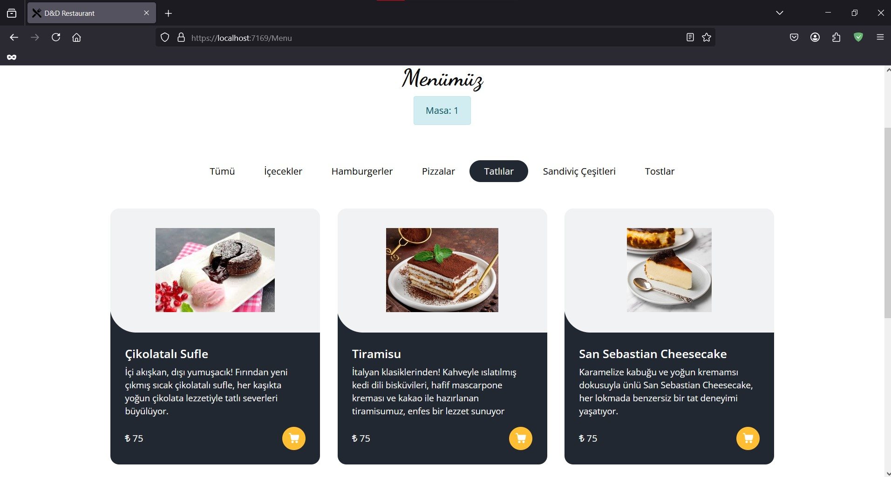
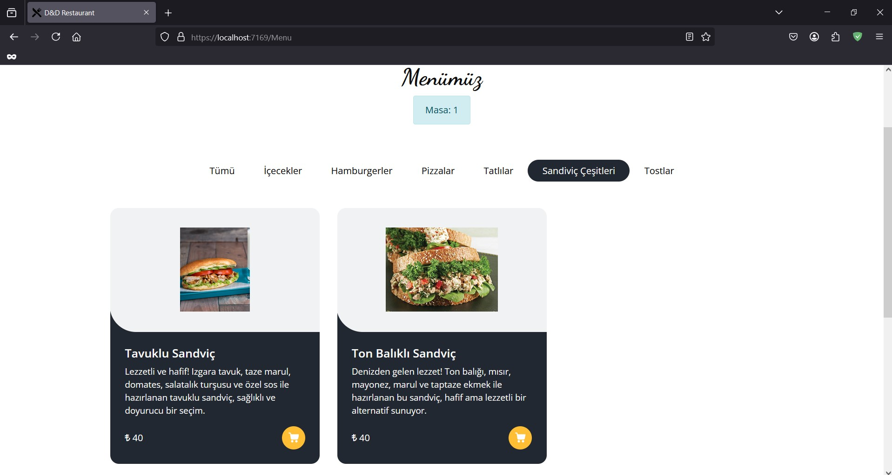
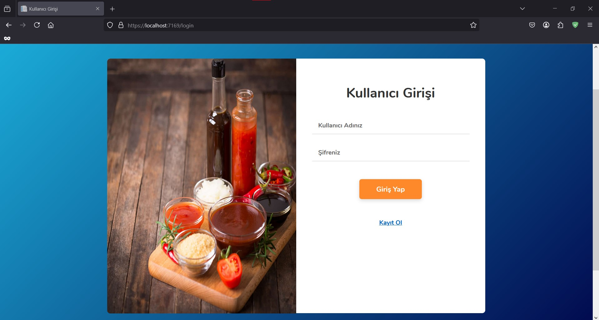
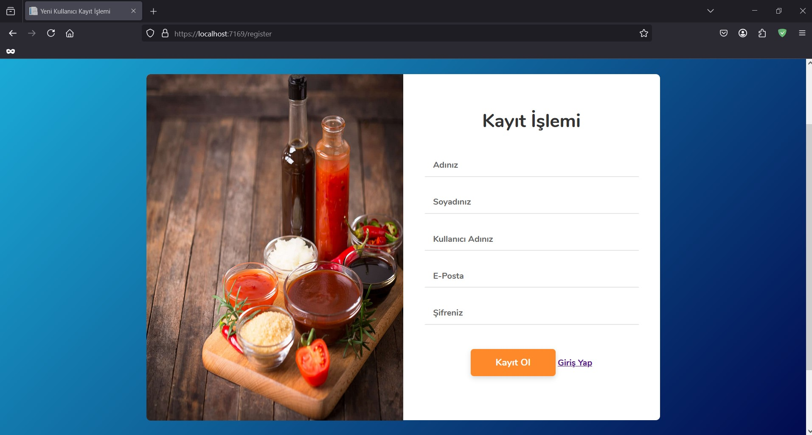
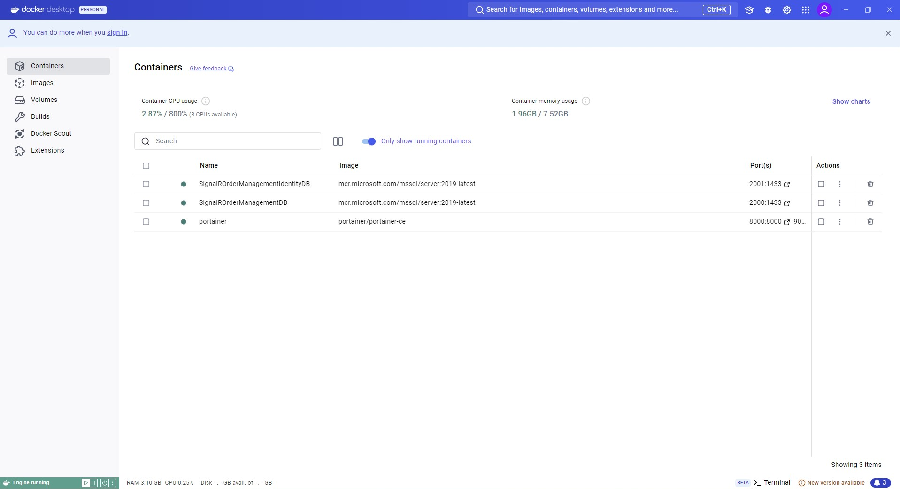
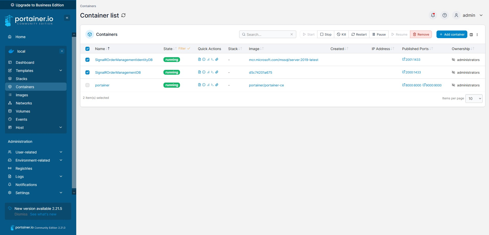
**QR Kod taranamazsa manuel olarak masa seçimi yapılır.**
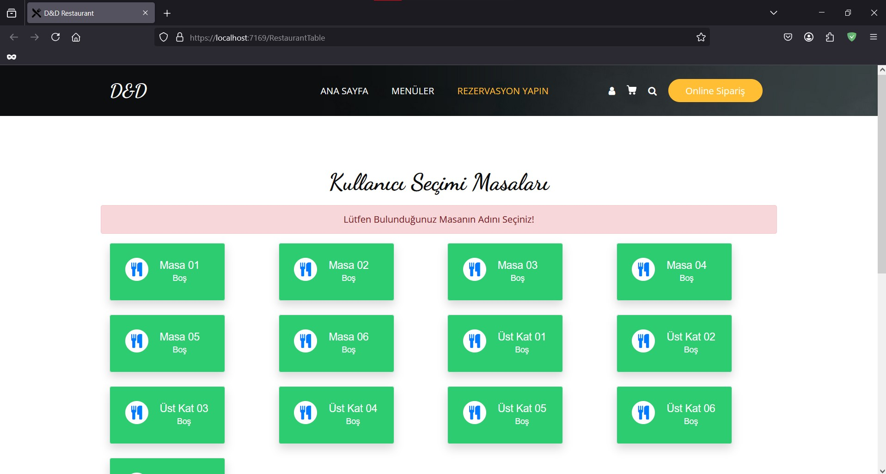
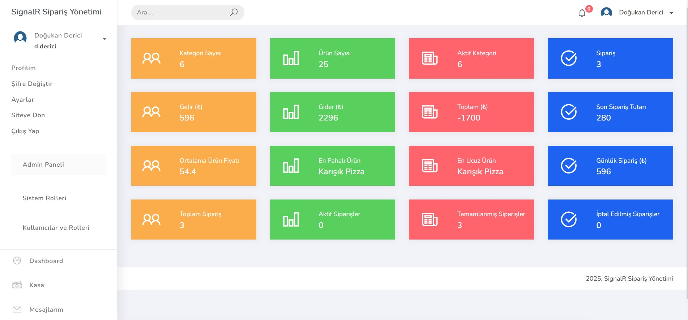
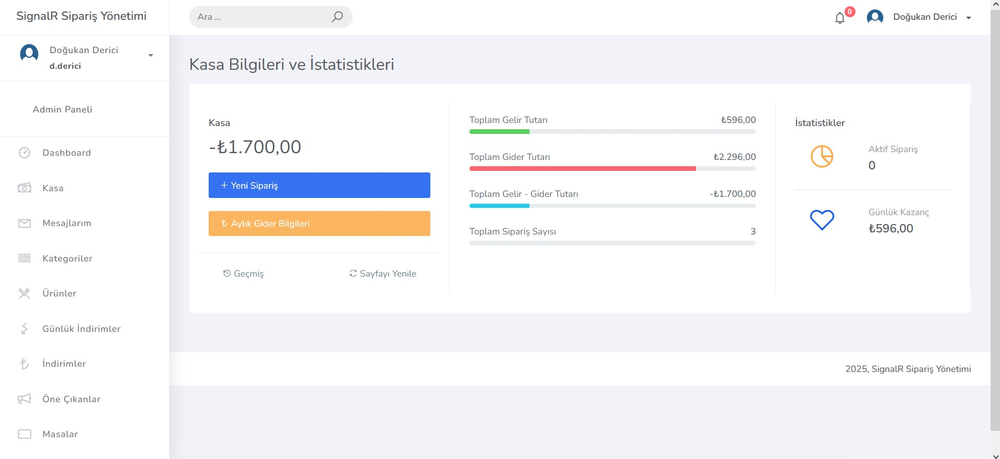
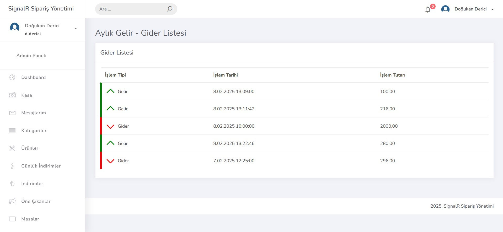
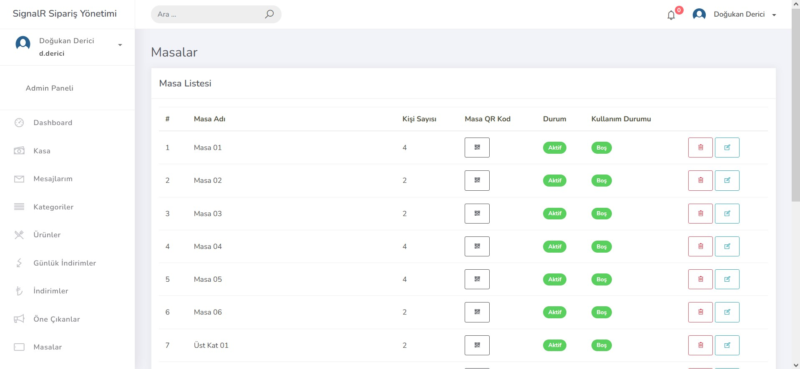
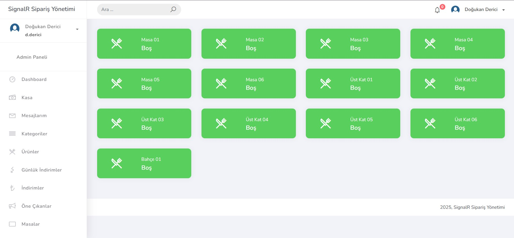
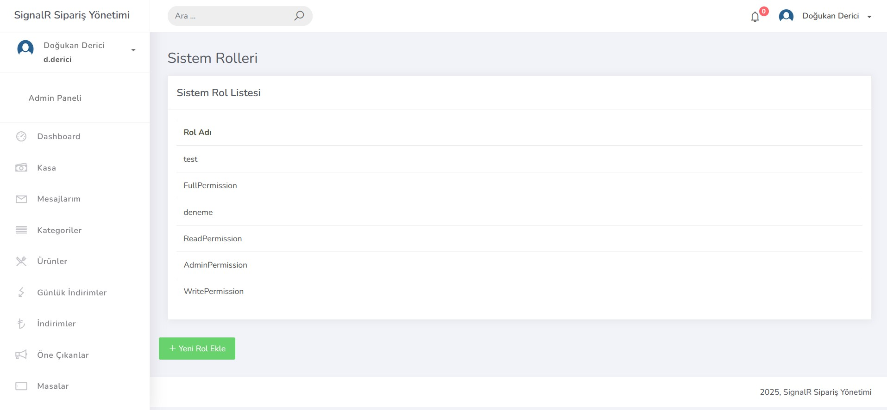
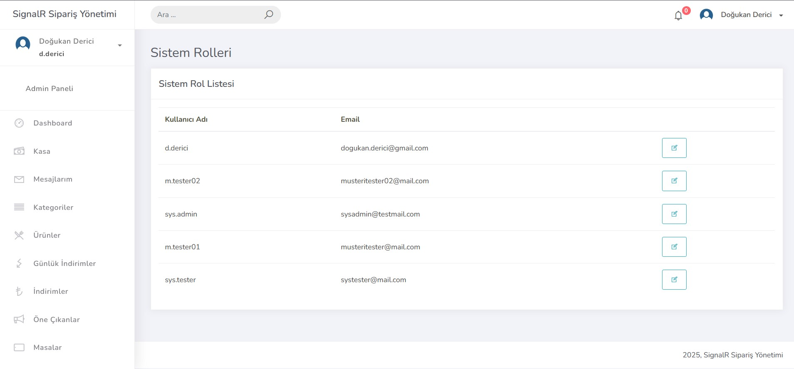
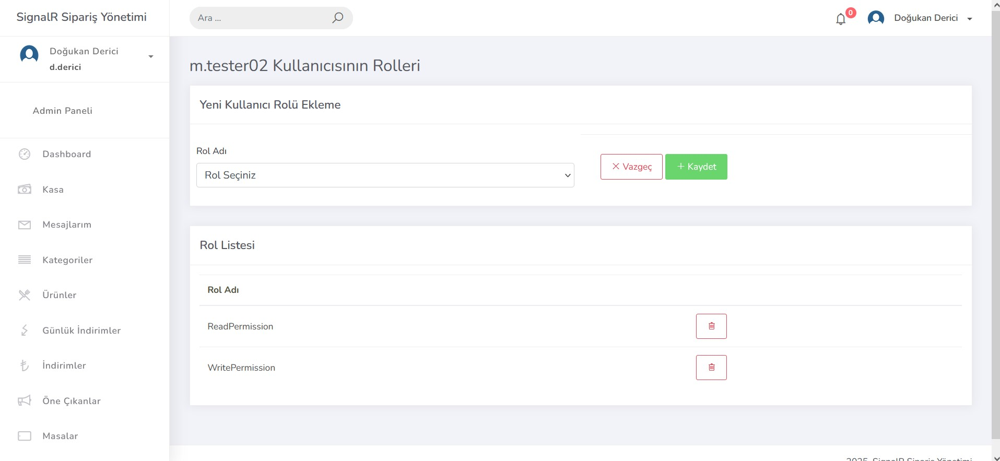